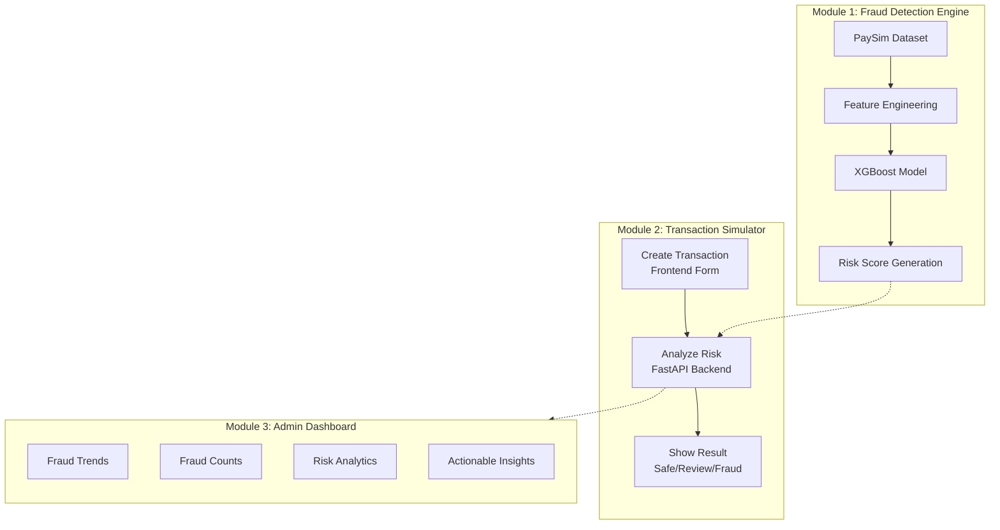

# FinShield AI: System Architecture

Based on your outline, here is the architectural mapping of the application we've built. The system is divided into three core modules that work together to provide real-time fraud detection and analytics.

## System Workflow

## Module Breakdown

### Module 1: Fraud Detection Engine (Core)
The brain of the operation. We trained an XGBoost classifier on the PaySim financial dataset to detect laundering and fraud patterns.
* **PaySim**: The synthetic financial dataset used for training (`financial.py`).
* **Feature Engineering**: Encoding categorical variables (like transaction type) and scaling amounts (`type_encoder.pkl`, `feature_columns.pkl`).
* **XGBoost**: The highly optimized gradient boosting model (`fraud_model.pkl`).
* **Risk Score**: The model outputs a probability which is converted into a 0-100 risk score and categorized (Safe, Review, Fraud).

### Module 2: Transaction Simulator
The user-facing banking portal where transactions originate.
* **Create Transaction**: The frontend interface where users enter transfer details (`BankingDashboard.tsx`).
* **Analyze Risk**: The payload is sent to the FastAPI backend, which runs it through the XGBoost engine in real-time.
* **Show Result**: Instant feedback is provided to the user, blocking the transfer if the risk score is too high.

### Module 3: Admin Dashboard
The risk analyst portal for monitoring system health and investigating flagged transactions.
* **Fraud Trends**: Time-series charts comparing legitimate vs fraudulent volumes.
* **Fraud Counts**: Real-time metrics on intercepted transactions.
* **Risk Analytics**: Distribution histograms of risk scores across the network.
* **Insights**: Explainable AI components that break down exactly *why* a transaction was flagged.

> [!TIP]
> The application is fully functional across all three modules. You can test **Module 2** at `localhost:5173/banking/dashboard` and monitor the results in **Module 3** at `localhost:5173/admin`.
